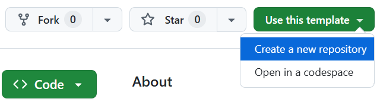
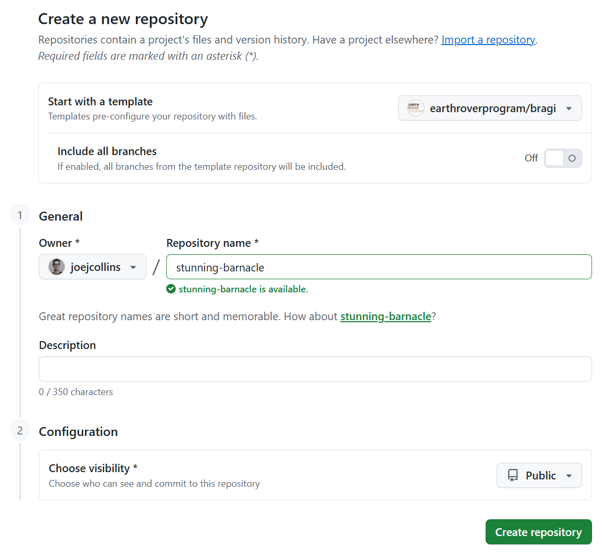
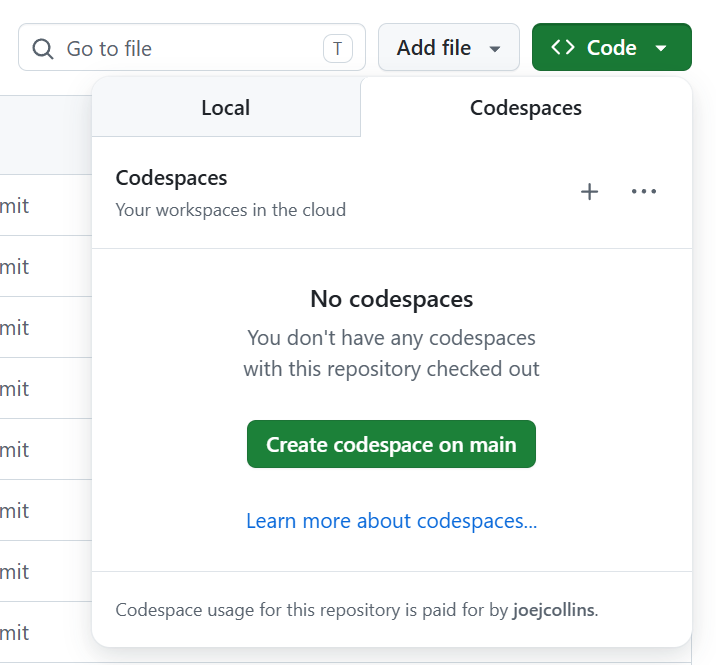
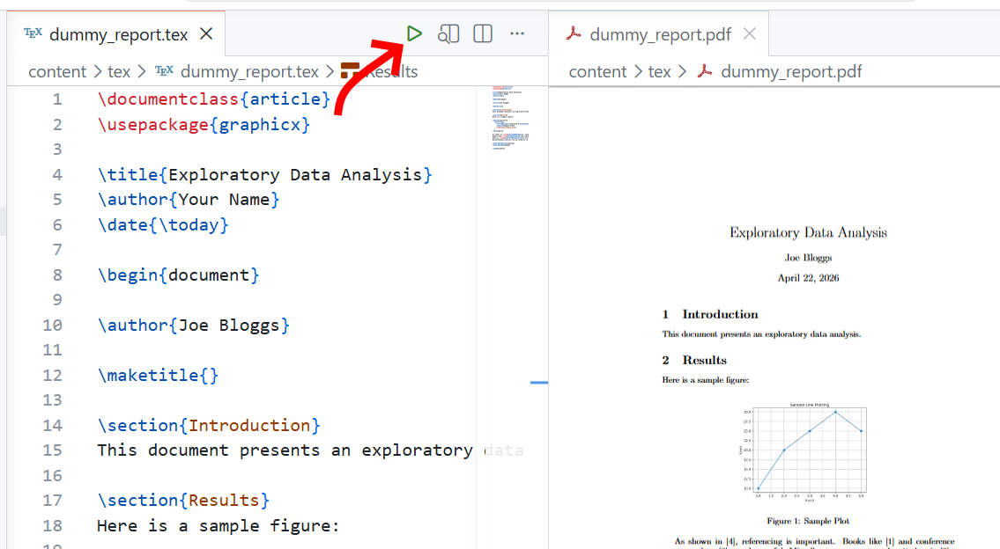
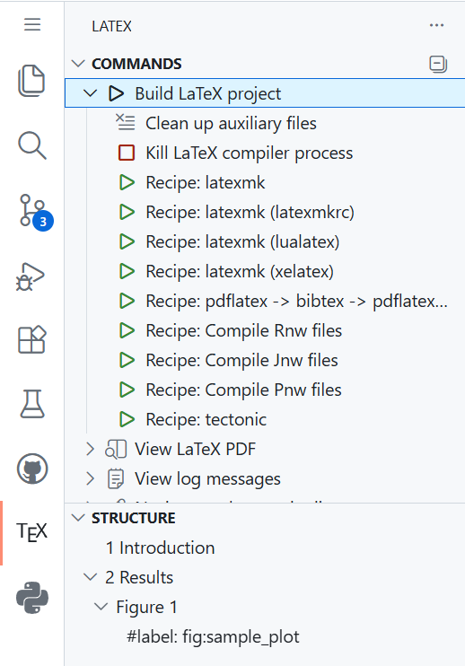

# Use in a Codespace

1. Visit [https://github.com/earthroverprogram/bragi](https://github.com/earthroverprogram/bragi).
1. Create your own repo based on this template.

1. Name your repo and set the visibility you want.

1. Open the repo in a Codespace.

1. Open and build [dummy_report.tex](content/tex/dummy_report.tex).

1. Use the commands provided by LaTeX Workshop.

